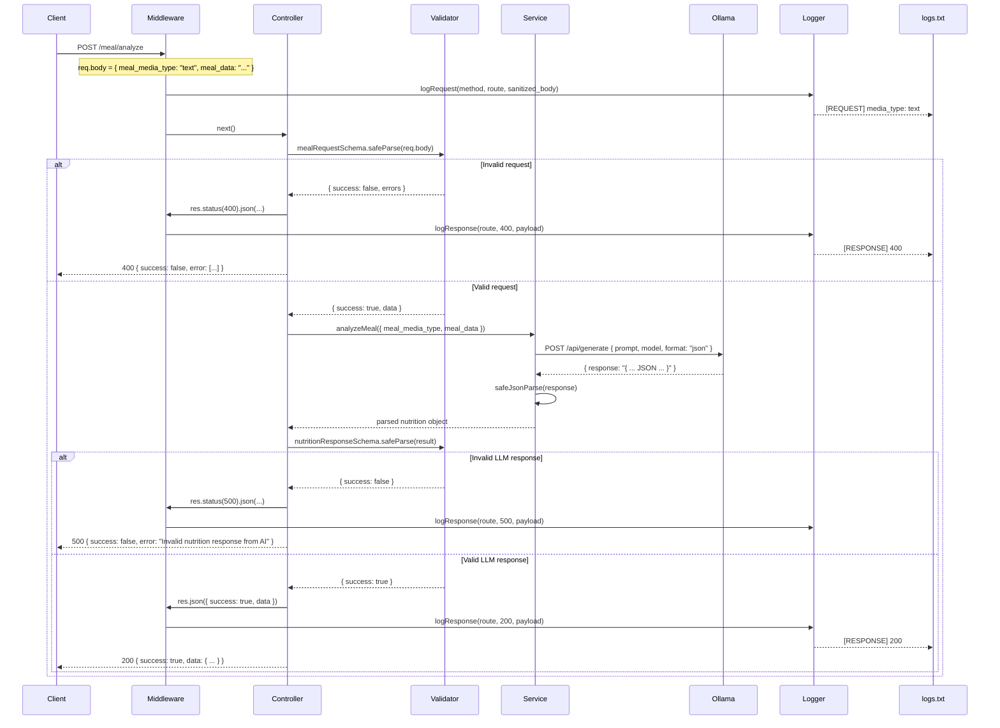
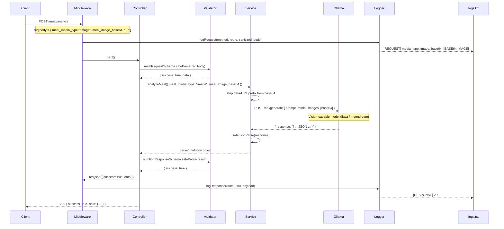

# Low Level Design — Calories Calculator Agent

## 1. Architecture Overview

```
┌─────────────────────────────────────────────────────────┐
│                        Client (iOS)                     │
└──────────────────────────┬──────────────────────────────┘
                           │ HTTP Request
                           ▼
┌─────────────────────────────────────────────────────────┐
│                    Express Server                       │
│                                                         │
│  ┌─────────────┐   ┌──────────────┐   ┌─────────────┐  │
│  │ express.json│ → │ Log Middleware│ → │   Router    │  │
│  │  (parser)   │   │  (logs.txt)  │   │ /meal/analyze│  │
│  └─────────────┘   └──────────────┘   └──────┬──────┘  │
│                                               │         │
│                                    ┌──────────▼──────┐  │
│                                    │   Controller    │  │
│                                    │ (validate req)  │  │
│                                    └──────────┬──────┘  │
│                                               │         │
│                                    ┌──────────▼──────┐  │
│                                    │    Service      │  │
│                                    │ (Ollama call)   │  │
│                                    └──────────┬──────┘  │
│                                               │         │
└───────────────────────────────────────────────┼─────────┘
                                                │ HTTP
                                                ▼
                                  ┌─────────────────────────┐
                                  │     Ollama (Local LLM)  │
                                  │   qwen2.5 / llava etc.  │
                                  └─────────────────────────┘
```

---

## 2. Request Flow — Text Meal Analysis



---

## 3. Request Flow — Image Meal Analysis



---

## 4. Logging Flow

```mermaid
flowchart TD
    A[Incoming Request] --> B[Log Middleware]
    B --> C{req.body empty?}
    C -- Yes --> D[Log media_type: N/A, Payload: {}]
    C -- No --> E{meal_media_type?}
    E -- text --> F[Log media_type: text\nPayload with meal_data]
    E -- image --> G[Log media_type: image\nPayload with Base64 masked]
    E -- missing --> D

    D & F & G --> H[Write to logs.txt]
    H --> I[Pass to next handler]

    I --> J{Response or Error?}
    J -- Response --> K[res.json patched\nlogResponse to logs.txt]
    J -- Error --> L[Global error handler\nlogError with stack trace]
```

---

## 5. Component Responsibilities

| Component | File | Responsibility |
|---|---|---|
| Server | `server.js` | Boots HTTP server on configured port |
| App | `app.js` | Mounts middleware, router, error handler |
| Log Middleware | `app.js` | Captures req/res payloads, writes to `logs.txt` |
| Router | `routes/meals.routes.js` | Maps `POST /analyze` to controller |
| Controller | `controllers/meal.controller.js` | Validates request + LLM response, delegates to service |
| Service | `services/olama.service.js` | Builds Ollama request body, handles text vs image routing |
| Prompt Builder | `prompts/nutrition.prompt.js` | Returns text or image prompt string |
| Validator | `validators/meal.validator.js` | Zod schemas for request (discriminated union) and nutrition response |
| Logger | `utils/logger.util.js` | Sanitizes and appends log entries to `logs.txt` |
| JSON Util | `utils/json.util.js` | Safe JSON parse wrapper |

---

## 6. Error Handling Matrix

| Scenario | HTTP Status | Response |
|---|---|---|
| Missing / wrong `meal_media_type` | 400 | `{ success: false, error: [Zod errors] }` |
| `meal_data` too short (< 2 chars) | 400 | `{ success: false, error: [Zod errors] }` |
| Ollama unreachable | 500 | `{ success: false, error: "Unable to reach Ollama..." }` |
| Ollama timeout | 500 | `{ success: false, error: "Ollama request timed out..." }` |
| LLM returns malformed JSON | 500 | `{ success: false, error: "Invalid JSON received from Ollama" }` |
| LLM JSON fails nutrition schema | 500 | `{ success: false, error: "Invalid nutrition response from AI" }` |
| Unhandled exception | 500 | `{ success: false, error: <message> }` |
